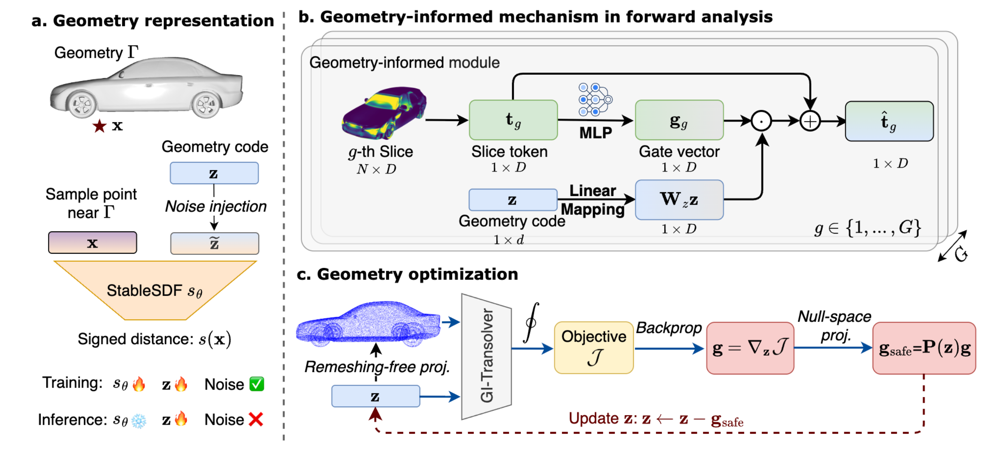
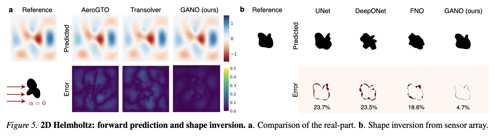
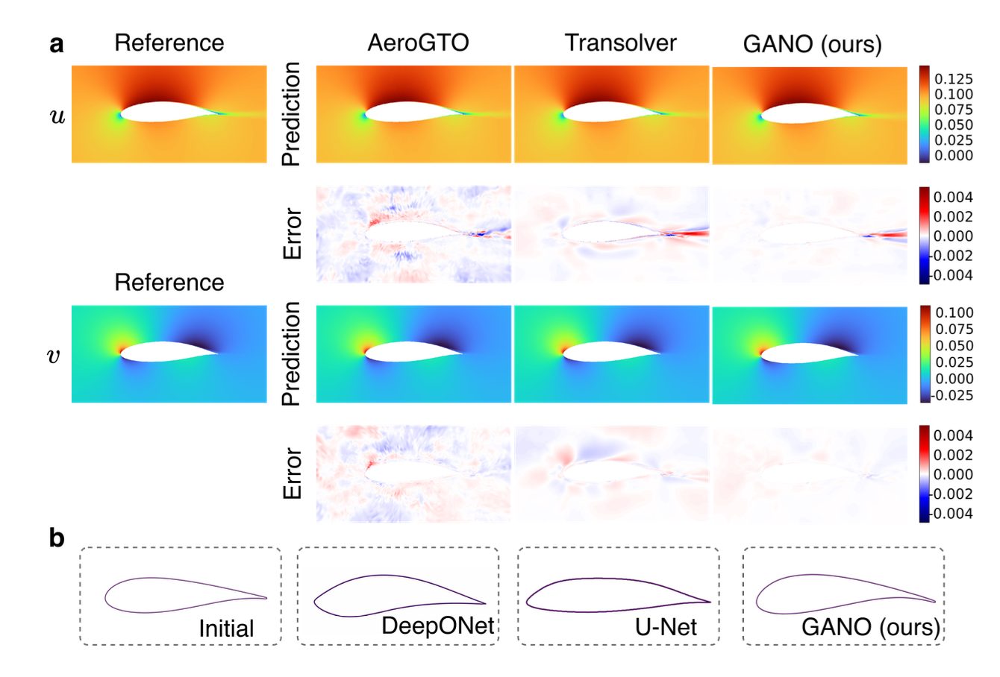
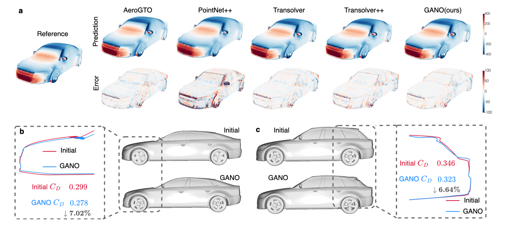
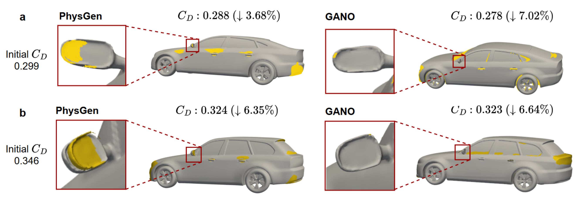
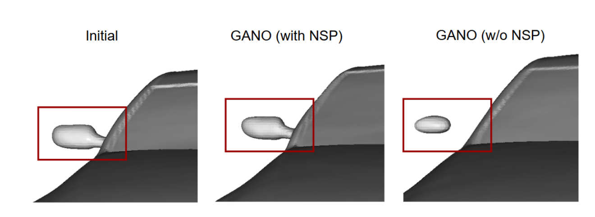

# GANO: Geometry-Aware Neural Optimizer for Shape Optimization and Inversion

<div align="center">

[](https://arxiv.org/abs/2605.04474)
[](https://icml.cc/)
[](LICENSE)

**Official implementation of _Geometry-Aware Neural Optimizer for Shape Optimization and Inversion_**

Guoze Sun<sup>\*</sup>, Tianya Miao<sup>\*</sup>, Haoyang Huang, Huaguan Chen,<br>
Han Wan, Rui Zhang<sup>†</sup>, Hao Sun<sup>†</sup>

Gaoling School of Artificial Intelligence, Renmin University of China

**ICML 2026**

[Paper](https://arxiv.org/abs/2605.04474) ·
[Code](https://github.com/intell-sci-comput/GANO)  ·
[Data](#data-preparation) ·

<sup>\*</sup> Equal contribution.<br>
<sup>†</sup> Corresponding authors.

</div>

<!--
MARKDOWN FORMULA CONVENTION:
- Use $...$ for inline formulas.
- Use $$...$$ for standalone formulas.
- Do not use alternative display-math delimiters, because they may not render correctly in some Markdown viewers.
-->

<p align="center">
  
</p>


## Overview

Geometry is a central design variable in many PDE-governed systems, but conventional shape optimization and inversion require repeated numerical simulation, geometry modification, and remeshing. These operations are computationally expensive and often require substantial expert intervention.

**GANO** is an end-to-end differentiable framework that unifies:

1. **geometry representation** with **StableSDF**;
2. **field-level physical prediction** with **GI-Transolver**;
3. **latent-space geometry optimization and inversion**;
4. **part-wise geometry control** through null-space projection; and
5. **remeshing-free vehicle surface updates** through SDF-based projection.

The framework is evaluated on three benchmarks:

- **2D Helmholtz:** forward scattering prediction and shape inversion;
- **2D Airfoil:** flow-field prediction and aerodynamic shape optimization;
- **3D Vehicle:** surface-pressure prediction and drag-minimizing optimization.

## Highlights

- **End-to-end differentiable geometry optimization.** GANO propagates gradients from field-level objectives through the physical surrogate to a compact geometry latent code.
- **Stable latent geometry updates.** StableSDF supports Gaussian perturbations to latent codes during training, inducing an implicit latent-Jacobian regularization and reducing sensitivity to latent perturbations. The released vehicle benchmark enables this mechanism.
- **Geometry-informed field prediction.** GI-Transolver explicitly injects geometry codes into Transolver slice tokens, creating an effective gradient pathway from predicted physical fields to geometry.
- **Part-wise control.** Null-space projection suppresses first-order changes at selected constraint points, allowing designated components to remain fixed during optimization.
- **Remeshing-free vehicle optimization.** In the released vehicle workflow, boundary query points are projected onto the updated implicit surface without reconstructing a new mesh at every iteration.
- **2D and 3D validation.** GANO supports inverse scattering, airfoil optimization, and vehicle aerodynamic optimization in one unified framework.

## Method

### StableSDF

StableSDF represents a geometry with a signed distance decoder

$$
s = s_\theta(\mathbf{x}, \mathbf{z}),
$$

where $\mathbf{x}$ is a spatial coordinate and $\mathbf{z}$ is a geometry latent
code. StableSDF can perturb the latent code during training:

$$
\tilde{\mathbf{z}} = \mathbf{z} + \boldsymbol{\epsilon},
\qquad
\boldsymbol{\epsilon}\sim\mathcal{N}(0,\sigma^2I).
$$

This denoising-style training encourages locally smooth and controllable
geometry changes during latent-space optimization. In the released scripts,
latent noise is enabled for the 3D vehicle benchmark with $\sigma=0.005$ and
disabled after epoch 720. The Helmholtz and airfoil training scripts use clean
latent codes ($\sigma=0$).

### GI-Transolver

GI-Transolver extends Transolver by injecting the geometry code into the slice-token space through a gated residual mechanism. It predicts full physical fields rather than a fixed scalar objective, enabling flexible objectives defined over global or local physical quantities.

### Differentiable Optimization and Inversion

Given a trained StableSDF decoder and GI-Transolver surrogate, GANO freezes their model parameters and iteratively updates the geometry latent code:

$$
\mathbf{z}_{t+1} = \mathbf{z}_t - \eta\,\mathbf{g}_{\mathrm{safe}}.
$$

For unconstrained optimization, the safe gradient is

$$
\mathbf{g}_{\mathrm{safe}} = \nabla_{\mathbf{z}}\mathcal{J}.
$$

For part-wise control, the gradient can be projected onto the null space of the constraint Jacobian.

For vehicle optimization, surface query points are moved back to the updated
zero level set after each latent update using an SDF-based projection, avoiding
repeated remeshing. The released Helmholtz inversion and airfoil optimization
scripts do not apply this surface-point projection.

## Main Results

### Forward Prediction

| Benchmark | Metric | GANO |
|---|---:|---:|
| 2D Helmholtz | Relative L1 | **0.0171** |
| 2D Helmholtz | Relative L2 | **0.0170** |
| 2D Airfoil | Relative L1 | **0.0008** |
| 2D Airfoil | Relative L2 | **0.0022** |
| 3D Vehicle | Relative L1 | **0.1655** |
| 3D Vehicle | Relative L2 | **0.1782** |

### Shape Optimization

| Task | Initial result | Optimized result | Improvement |
|---|---:|---:|---:|
| Airfoil lift-to-drag ratio $C_L/C_D$ | 53.6 | **83.4** | **+55.9%** |
| Fastback drag coefficient $C_D$ | 0.299 | **0.278** | **-7.02%** |
| Estateback drag coefficient $C_D$ | 0.346 | **0.323** | **-6.64%** |

The optimized airfoils are validated with COMSOL, while the optimized vehicles are validated with high-fidelity OpenFOAM simulations.

### 2D Helmholtz Shape Inversion

<p align="center">
  
</p>

### 2D Airfoil Shape Optimization

<p align="center">
  
</p>

### 3D Vehicle Shape Optimization

<p align="center">
  
</p>


### Comparison with PhysGen

<p align="center">
  
</p>

### Part-wise Control

<p align="center">
  
</p>


## Repository Structure

```text
GANO/
├── checkpoints/                    # Checkpoints generated by training
├── data/                           # Dataset instructions and processed data
├── scripts/
│   ├── airfoil/
│   │   ├── train_stablesdf_airfoil.py
│   │   ├── train_gi_transolver.py
│   │   └── optimize_airfoil.py
│   ├── car/
│   │   ├── train_stablesdf_car.py
│   │   ├── train_gi_transolver_car.py
│   │   └── optimize_vehicle.py
│   ├── hh/
│   │   ├── train_stablesdf.py
│   │   ├── train_gi_transolver.py
│   │   └── optimize_hh.py
│   └── reproduce/                 # Stage-aware reproduction wrappers
│       ├── helmholtz.sh
│       ├── airfoil.sh
│       └── vehicle.sh
├── src/
│   ├── airfoil/                    # Airfoil models and utilities
│   ├── car/                        # Vehicle models and utilities
│   └── hh/                         # Helmholtz models and utilities
├── LICENSE
├── README.md
└── requirements.txt
```


## Installation

### 1. Clone the Repository

```bash
git clone https://github.com/intell-sci-comput/GANO.git
cd GANO
```

### 2. Create a Conda Environment

```bash
conda create -n gano python=3.11 -y
conda activate gano
```

### 3. Install PyTorch

The released code was tested with PyTorch 2.5.1 and CUDA 12.1. Install the
corresponding official wheels with:

```bash
pip install torch==2.5.1 torchvision==0.20.1 \
    --index-url https://download.pytorch.org/whl/cu121
```

For a different CUDA platform or a CPU-only installation, select the matching
command from the [official PyTorch installation guide](https://pytorch.org/get-started/locally/).

### 4. Install Dependencies

```bash
pip install -r requirements.txt
```

### Tested Environment

| Component | Version |
|---|---|
| Operating system | Ubuntu 20.04 |
| Python | 3.11.14 |
| PyTorch | 2.5.1 |
| CUDA runtime | 12.1 |
| GPU | NVIDIA A100 / H800 |
| NumPy | 1.24.2 |

## Data Preparation

GANO uses locally generated data for the 2D Helmholtz benchmark and two public
datasets for the aerodynamic benchmarks.

| Benchmark | Source | Data used by GANO |
|---|---|---|
| 2D Helmholtz | Generated by this repository | Random obstacles, SDF samples, and finite-difference scattering fields |
| 2D Airfoil | [Airfoil CFD 9k (OEDI)](https://data.openei.org/submissions/5889) | All 8,996 airfoils at $4^\circ$ angle of attack |
| 3D Vehicle | [DrivAerNet++](https://github.com/Mohamedelrefaie/DrivAerNet) | STL geometry and surface-pressure VTK data for 8,129 valid designs |

See [`data/README.md`](data/README.md) for download instructions, data formats,
normalization conventions, split definitions, and environment-variable path
overrides. Run every command below from the repository root.

### Expected Data Layout

```text
data/
├── README.md
├── hh/
│   ├── scattering_shapes_256.npz
│   ├── scattering_sdf_dataset_mixed.npz
│   ├── scattering_dataset_scat_fields_k7.npz
│   ├── scattering_dataset_normalized.npz
│   └── normalization_stats.pt
├── airfoil/
│   ├── raw/
│   │   └── airfoil_9k_data.h5
│   ├── airfoil_sdf_train.pt
│   └── airfoil_physics_train.pt
└── car/
    ├── raw/
    │   ├── 3DMeshesSTL/              # Recursive collection of .stl files
    │   └── PressureVTK/              # Recursive collection of .vtk files
    ├── sdf/                          # One .npz file per vehicle
    ├── pressure/
    │   ├── **/*.npz                  # One pressure file per vehicle
    │   └── dataset_stats.json
    └── split/
        ├── train.txt
        └── test.txt
```

### 2D Helmholtz

```bash
python data/hh/genshape.py
python data/hh/gensdf.py
python data/hh/genpde.py
python data/hh/normalize_pde.py
```

The default configuration generates 1,000 random obstacles on a $256\times256$
grid over $[-1,1]^2$. Each geometry has 10,000 SDF query points. The Helmholtz
solver uses wavenumber $k=7$ and 10 uniformly spaced incident angles; the final
complex scattered field is stored as standardized real and imaginary channels.

### 2D Airfoil

Download the 52.7 GB HDF5 file from [OEDI](https://data.openei.org/submissions/5889),
or use the anonymous public S3 endpoint:

```bash
mkdir -p data/airfoil/raw
aws s3 cp \
    s3://nrel-pds-windai/aerodynamic_shapes/2D/9k_airfoils/v1.0.0/airfoil_9k_data.h5 \
    data/airfoil/raw/airfoil_9k_data.h5 \
    --no-sign-request

python data/airfoil/preprocess_sdf_airfoil.py
```

This produces 4,096 SDF samples for each of the 8,996 airfoils. Because the
physics preprocessing requires the learned geometry codes, first train
StableSDF and then build the field dataset:

```bash
python scripts/airfoil/train_stablesdf_airfoil.py
python data/airfoil/preprocess_physics_airfoil.py
```

GANO extracts the $4^\circ$ flow group, retains points in
$[-1,2]\times[-1,1]$, converts $(\rho,\rho u,\rho v,e)$ to $(u,v,p)$, and
standardizes the three target channels globally.

### 3D Vehicle

Download the **3D Meshes (STL)** and **Pressure (VTK)** modalities from the
[DrivAerNet++ Harvard Dataverse](https://dataverse.harvard.edu/dataverse/DrivAerNet),
following the download instructions in the
[official repository](https://github.com/Mohamedelrefaie/DrivAerNet). The full
multimodal dataset is not required. Extract the two modalities into the layout
shown above, then run:

```bash
python data/car/preprocess_sdf_car.py
python data/car/preprocess_pressure_car.py
```

Both scripts search their input trees recursively, so the internal directories
created by the downloaded archives may be retained. Matching STL and VTK files
must have the same basename, which is used as the vehicle ID. GANO centers each
geometry at its bounding-box center and scales its bounding-box diagonal to
1.9. Each vehicle receives 100,000 SDF samples; pressure is standardized with
the fixed training-set statistics recorded in `dataset_stats.json`.

The provided split contains 7,316 training and 813 test vehicle IDs, covering
8,129 successfully processed DrivAerNet++ designs. The source dataset is
licensed separately from this repository; review its CC BY-NC 4.0 terms before
downloading or redistributing it.

## Checkpoints

Pretrained weights are not distributed with this repository. Running the
training commands below creates checkpoints in the locations expected by the
downstream scripts:

```text
checkpoints/
├── hh/
│   ├── stablesdf/
│   │   └── deepsdf_final.pth
│   └── transolver/
│       └── best_transolver.pth
├── airfoil_stablesdf/
│   ├── model_latest.pth
│   └── latents_latest.pth
├── airfoil_transolver/
│   └── airfoil_transolver_best.pth
├── car_training_h800_all/
│   ├── model_latest.pth
│   ├── latents_latest.pth
│   └── file_list.json
└── car_transolver/
    ├── best_model.pth
    └── transolver_sdf_normals_<timestamp>/
        ├── best_model.pth
        └── train.log
```

Checkpoint files are ignored by Git. Geometry codes and their associated index
or file-list metadata must be kept together because later stages rely on their
ordering.

## Training and Running GANO

Run all commands from the repository root after completing
[Installation](#installation) and [Data Preparation](#data-preparation). Each
benchmark follows the same sequence:

```text
processed geometry -> StableSDF + latent codes -> processed physical fields
                   -> GI-Transolver -> latent-space optimization or inversion
```

The scripts use their in-file `CONFIG` dictionaries and `GANO_*` environment
variables rather than positional command-line arguments. The commands below
use the default settings from the released experiments.

### Minimal End-to-End Check

Helmholtz is the smallest self-contained workflow because it does not require
an external dataset. In a fresh clone, the following reduced configuration
checks data generation, both training stages, and inversion:

```bash
GANO_SMOKE_TEST=1 python data/hh/genshape.py
GANO_SMOKE_TEST=1 python data/hh/gensdf.py
GANO_SMOKE_TEST=1 python data/hh/genpde.py
GANO_SMOKE_TEST=1 python data/hh/normalize_pde.py
GANO_SMOKE_TEST=1 python scripts/hh/train_stablesdf.py
GANO_SMOKE_TEST=1 python scripts/hh/train_gi_transolver.py
GANO_SMOKE_TEST=1 python scripts/hh/optimize_hh.py
```

Smoke-test mode uses the normal output filenames. Do not run these commands on
top of a prepared full dataset unless those files have been backed up.

### 2D Helmholtz: Shape Inversion

Generate the full dataset as described above, then run:

```bash
python scripts/hh/train_stablesdf.py
python scripts/hh/train_gi_transolver.py
python scripts/hh/optimize_hh.py
```

The stages communicate through these files:

| Stage | Main input | Main output |
|---|---|---|
| StableSDF | `data/hh/scattering_sdf_dataset_mixed.npz` | `checkpoints/hh/stablesdf/deepsdf_final.pth` |
| GI-Transolver | normalized fields and `deepsdf_final.pth` | `checkpoints/hh/transolver/best_transolver.pth` |
| Inversion | both checkpoints and `normalization_stats.pt` | `output/hh/inverse_vis/inverse_onecycle_result.png` |

For example, training length, batch size, worker count, and inversion steps can
be changed from the shell:

```bash
GANO_HH_STABLESDF_EPOCHS=500 \
GANO_HH_STABLESDF_BATCH_SIZE=64 \
python scripts/hh/train_stablesdf.py

GANO_HH_TRANSOLVER_EPOCHS=100 \
GANO_HH_TRANSOLVER_BATCH_SIZE=16 \
python scripts/hh/train_gi_transolver.py

GANO_HH_OPT_STEPS=200 \
GANO_HH_OPT_NUM_SENSORS=100 \
python scripts/hh/optimize_hh.py
```

### 2D Airfoil: Shape Optimization

Airfoil field preprocessing depends on the StableSDF latent codes. The complete
order is therefore:

```bash
python data/airfoil/preprocess_sdf_airfoil.py
python scripts/airfoil/train_stablesdf_airfoil.py
python data/airfoil/preprocess_physics_airfoil.py
python scripts/airfoil/train_gi_transolver.py
python scripts/airfoil/optimize_airfoil.py
```

The final command starts from airfoil index 0 and writes:

```text
output/airfoil_optimization/
├── optimized_airfoil_comsol.txt
├── optimized_fields.npz
├── z_opt.pt
├── airfoil_mask.png
├── airfoil_contour.png
└── optimized_cl_cd_result.png
```

Common resource and optimization settings can be overridden as follows:

```bash
GANO_AIRFOIL_STABLESDF_EPOCHS=500 \
GANO_AIRFOIL_STABLESDF_BATCH_SIZE=64 \
python scripts/airfoil/train_stablesdf_airfoil.py

GANO_AIRFOIL_TRANSOLVER_EPOCHS=100 \
GANO_AIRFOIL_TRANSOLVER_BATCH_SIZE=32 \
GANO_AIRFOIL_TRANSOLVER_NUM_WORKERS=4 \
python scripts/airfoil/train_gi_transolver.py

GANO_AIRFOIL_OPT_SAMPLE_IDX=100 \
GANO_AIRFOIL_OPT_STEPS=150 \
GANO_AIRFOIL_OPT_OUTPUT_DIR=output/airfoil_optimization_sample_100 \
python scripts/airfoil/optimize_airfoil.py
```

The selected sample index refers to the row order stored in
`data/airfoil/airfoil_physics_train.pt`.

### 3D Vehicle: Shape Optimization

Vehicle StableSDF training explicitly loads the complete processed SDF set into
GPU memory and therefore requires a CUDA GPU with substantial memory. To start
a new run rather than resume an existing checkpoint:

```bash
GANO_CAR_STABLESDF_RESUME=0 \
GANO_CAR_STABLESDF_START_EPOCH=0 \
python scripts/car/train_stablesdf_car.py

python scripts/car/train_gi_transolver_car.py
```

GI-Transolver stores a timestamped experiment directory and also updates the
stable path `checkpoints/car_transolver/best_model.pth`, which is loaded by the
optimization script. After arranging component meshes under
`data/car/parts/<vehicle-id>/` as described in `data/README.md`, run:

```bash
GANO_CAR_OPT_CAR_ID=E_S_WW_WM_395 \
python scripts/car/optimize_vehicle.py
```

The vehicle ID must exist in the StableSDF `file_list.json`, and its component
directory must contain STL files. A run writes:

```text
output/car_optimization/
└── opt_drag_nullspace_transolver_lbfgs_<vehicle-id>_<timestamp>/
    ├── objs/
    │   ├── shape_0000.obj
    │   └── shape_0040.obj
    ├── latest_opt.pth
    ├── optimized_z.pt
    ├── drag_history.npy
    └── loss_history.npy
```

For smaller GPUs, reduce the per-vehicle pressure samples and batch size during
GI-Transolver training. This does not reduce the full-dataset GPU allocation in
the current StableSDF implementation.

```bash
GANO_CAR_NUM_POINTS=20000 \
GANO_CAR_BATCH_SIZE=4 \
GANO_CAR_NUM_WORKERS=4 \
python scripts/car/train_gi_transolver_car.py

GANO_CAR_OPT_CAR_ID=E_S_WW_WM_395 \
GANO_CAR_OPT_STEPS=20 \
GANO_CAR_OPT_OUTPUT_DIR=output/car_optimization_short \
python scripts/car/optimize_vehicle.py
```

## Part-wise Geometry Control

Vehicle optimization applies null-space projection by default. It samples
constraint points from component files containing `Mirrors` in their names and
falls back to files containing `wheels` when no mirror mesh is found. Run a
specific vehicle with:

```bash
GANO_CAR_OPT_CAR_ID=E_S_WW_WM_395 \
GANO_CAR_OPT_PARTS_ROOT=data/car/parts \
python scripts/car/optimize_vehicle.py
```

The component layout and case-sensitive naming rules are documented in
[`data/README.md`](data/README.md#optional-component-meshes-for-part-wise-optimization).
The script centers and scales all parts together using the same bounding-box
diagonal normalization as training, samples 16 constraint points by default,
and projects each latent gradient with $I-J^\dagger J$. Components whose
filenames begin with `Mirrors`, `Underbody`, or `wheels` are excluded from the
drag objective's optimizable surface.

<p align="center">
  
</p>

## Reproducing the Paper

The reproduction wrappers preserve the dependency order between data
preparation, StableSDF training, physical-field preprocessing, GI-Transolver
training, and optimization. Run them from any directory; each wrapper first
changes to the repository root.

```text
scripts/reproduce/
├── helmholtz.sh
├── airfoil.sh
└── vehicle.sh
```

After preparing the external datasets described in
[`data/README.md`](data/README.md), a complete benchmark can be run with:

```bash
bash scripts/reproduce/helmholtz.sh all
bash scripts/reproduce/airfoil.sh all
bash scripts/reproduce/vehicle.sh all
```

Each wrapper also exposes individual stages:

| Benchmark | Available stages |
|---|---|
| Helmholtz | `prepare`, `train-sdf`, `train-physics`, `invert`, `all` |
| Airfoil | `prepare-sdf`, `train-sdf`, `prepare-physics`, `train-physics`, `optimize`, `all` |
| Vehicle | `prepare`, `train-sdf`, `train-physics`, `optimize`, `all` |

For example, the following commands retrain only the airfoil physical surrogate
and then rerun shape optimization:

```bash
bash scripts/reproduce/airfoil.sh train-physics
bash scripts/reproduce/airfoil.sh optimize
```

All `GANO_*` overrides are passed through to the underlying Python scripts:

```bash
GANO_CAR_EPOCHS=100 \
GANO_CAR_BATCH_SIZE=8 \
bash scripts/reproduce/vehicle.sh train-physics

GANO_CAR_OPT_CAR_ID=F_D_WM_WW_2689 \
bash scripts/reproduce/vehicle.sh optimize
```

For a lightweight pipeline check that requires no external data, use:

```bash
GANO_SMOKE_TEST=1 bash scripts/reproduce/helmholtz.sh all
```

This smoke workflow has been tested from shape generation through inversion.
It writes to the standard Helmholtz data and checkpoint paths, so use it only
in a fresh clone or after backing up full-resolution artifacts. Full experiment
runs remain stochastic where the preprocessing or training script samples
points randomly.

## Configuration and Important Hyperparameters

The tables below summarize the executable defaults in the released scripts.
Values supplied through the `GANO_*` environment variables take precedence.

### StableSDF

| Setting | Helmholtz | Airfoil | Vehicle |
|---|---:|---:|---:|
| Coordinate dimension | 2 | 2 | 3 |
| Latent dimension | 64 | 64 | 256 |
| Hidden dimension | 256 | 256 | 512 |
| Decoder architecture | 4 hidden layers + output | 4 hidden layers + output | 8 linear layers |
| Positional-encoding frequencies | 6 | 6 | 4 |
| SDF points per shape | 10,000 | 4,096 | 100,000 |
| Batch definition | 128 shapes | 128 shapes | 500,000 points |
| Training epochs | 1,000 | 1,000 | 800 |
| Optimizer and learning rate | Adam, $10^{-4}$ | Adam, $5\times10^{-4}$ | Adam, $10^{-4}$ |
| SDF reconstruction loss | L1, clamped at 0.05 | L1 | Surface-weighted L1, clamped at 0.1 |
| Latent regularization weight | $10^{-4}$ | $10^{-4}$ | $10^{-4}$ |
| Latent noise | None | None | $\sigma=0.005$, disabled after epoch 720 |

For the vehicle loss, samples with $|\mathrm{SDF}|<0.02$ receive a weight of
6. The vehicle reproduction wrapper starts StableSDF from epoch 0; the Python
training script itself defaults to resuming the original long-running setup
from epoch 400 when invoked directly.

### GI-Transolver

| Setting | Helmholtz | Airfoil | Vehicle |
|---|---:|---:|---:|
| Input features | $(x,y)$ and incident angle | $(x,y)$ | $(x,y,z)$ and SDF normal |
| Predicted fields | Real/imaginary wave field | $u,v,p$ | Pressure |
| Geometry-code dimension | 64 | 64 | 256 |
| Hidden dimension | 256 | 256 | 256 |
| Transolver blocks | 4 | 5 | 5 |
| Attention heads | 8 | 8 | 8 |
| Physical slices | 32 | 32 | 32 |
| MLP ratio | 1 | 1 | 2 |
| Latent injection | Every block | Every block | Every block |
| Sampled points per item | 4,096 | 4,096 | 50,000 |
| Batch size | 32 | 64 | 16 |
| Training epochs | 200 | 200 | 200 |
| Optimizer | AdamW | AdamW | AdamW |
| Peak learning rate | $5\times10^{-4}$ | $5\times10^{-4}$ | $10^{-3}$ |
| Learning-rate schedule | OneCycle | OneCycle | 10-epoch warmup + cosine |
| Weight decay | $10^{-5}$ | 0 | 0 |
| Gradient clipping | 1.0 | 2.0 | 1.0 |

All three models use zero dropout and seed 42. Vehicle training uses bfloat16
automatic mixed precision and a Huber loss with $\delta=8$ after clamping the
normalized pressure target to $[-8,5]$.

### Latent-Space Optimization and Inversion

| Setting | Helmholtz inversion | Airfoil optimization | Vehicle optimization |
|---|---:|---:|---:|
| Objective | Sparse-sensor field L1 | Maximize $C_l$ with $C_d\leq0.020$ penalty | Minimize pressure drag |
| Optimizer | Adam + OneCycle | Adam | L-BFGS |
| Outer steps | 100 | 100 | 40 |
| Learning rate | Max $10^{-2}$ | $10^{-3}$ | $5\times10^{-3}$ |
| Latent regularization | $\displaystyle \frac{10^{-4}}{d_z}\sum_{j=1}^{d_z}z_j^2$ | $\displaystyle 10^{-4}\sum_{j=1}^{d_z}z_j^2$ | $\displaystyle \frac{10^{-4}}{d_z}\sum_{j=1}^{d_z}(z_j-z_{0,j})^2$ |
| Field/context points | 100 sensors + 4,096 context points | Up to 100,000 context points | 50,000 surface points |
| Surface projection | None | None | 5 SDF projection steps |
| Part-wise constraints | None | None | 16 points, $I-J^\dagger J$ projection |
| Geometry export resolution | N/A | $512^2$ | $512^3$ |

Here $d_z$ denotes the geometry-code dimension. The airfoil drag penalty is
$200\,\max(C_d-0.020,0)^2$. Vehicle L-BFGS uses at most two internal
iterations per outer step, a history size of 15, and rebuilds the null-space
projector after each step.

## Known Limitations

- Pretrained checkpoints are not distributed. Each benchmark must be trained
  from scratch before running inversion or shape optimization.
- The current implementation is specialized for the three released benchmarks.
  Extending GANO to a new physical system requires new preprocessing, field
  normalization, surrogate training, and a differentiable objective.
- Vehicle StableSDF training loads the complete processed SDF dataset into GPU
  memory and therefore requires a high-memory CUDA GPU.
- Optimization is restricted to the learned StableSDF latent space. This
  encourages shapes close to the training distribution but does not guarantee
  geometric validity, manufacturability, or satisfaction of constraints that
  are not explicitly included in the objective.
- Predicted improvements are based on the learned surrogate. Final optimized
  geometries should be validated using the corresponding high-fidelity
  numerical solver.
- Some preprocessing and point-sampling operations are stochastic, so results
  may vary slightly between runs even when the main training seed is fixed.
- Part-wise vehicle constraints require separately prepared component meshes
  and rely on the case-sensitive naming conventions documented in
  [`data/README.md`](data/README.md#optional-component-meshes-for-part-wise-optimization).

## Citation

If you find this work useful, please cite:

```bibtex
@article{sun2026geometry,
  title   = {Geometry-Aware Neural Optimizer for Shape Optimization and Inversion},
  author  = {Sun, Guoze and Miao, Tianya and Huang, Haoyang and
             Chen, Huaguan and Wan, Han and Zhang, Rui and Sun, Hao},
  journal = {arXiv preprint arXiv:2605.04474},
  year    = {2026}
}
```

## Acknowledgements

This work builds upon ideas and implementations from prior research on implicit neural representations, neural operators, and differentiable shape optimization.

In particular, please cite and acknowledge the upstream projects and datasets used by this repository, including:

- [DeepSDF](https://github.com/facebookresearch/DeepSDF);
- [Transolver](https://github.com/thuml/Transolver);
- AirFoil 9k;
- DrivAerNet++.


## License

This repository is released under the [PolyForm Noncommercial License 1.0.0](LICENSE).

The license permits noncommercial use, including research, experimentation, and study, subject to its terms. Please read the full license before using or redistributing the code.

For commercial use, please contact the authors.

## Contact

For questions about the code, please open a GitHub issue.

For research-related inquiries:

- Rui Zhang: [rayzhang@ruc.edu.cn](mailto:rayzhang@ruc.edu.cn)
- Hao Sun: [haosun@ruc.edu.cn](mailto:haosun@ruc.edu.cn)
